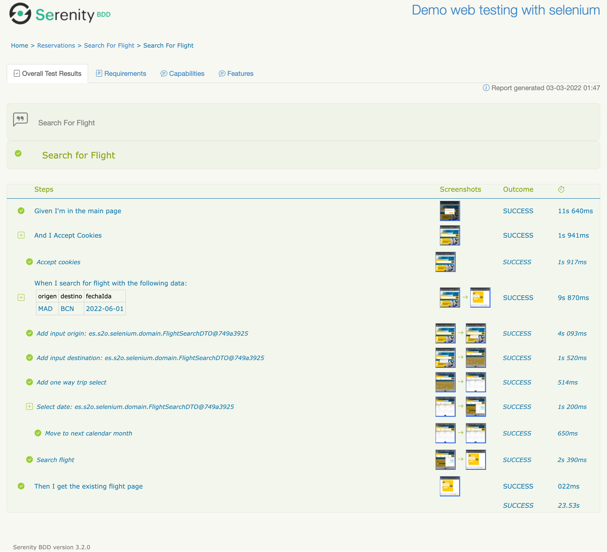

# Practice 2 (Selenium with Cucumber and Serenity)

This project has the purpose to test the next webpage ***https://www.vueling.com/es*** 
with the following data:

| Field         | Value       |
|:--------------|:------------|
| Origin        | Madrid      |
| Destination   | Barcelona   |
| Type Flight   | One Way     |
| Outbound Date | 01/07/2022  |
| Passenger     | 1           |

---

## Project Information

### - Programming Language:
* Java 11 

### - Technologies:

* Selenium
* Serenity
* Cucumber
* Gherkin
* Gradle

### - Model Pattern Used

* Page Object Model
* Builder

---

## Structure Project

1. FlightSearchDTO

Contains the data that we will need for test the web, 
the data will be given by Gherkin in `reservation.feature`

2. Pages

    2.1. Page Object Base

    Contains the variables that could be used in other pages.

    2.2. Reservation Page

    Contains the WebElements and the steps for testing the webpage

3. ReservationsStepdefs

Contains the steps definitions for Gherkin language

4. ReservationTest

This class connects to ReservationsStepdefs to `reservation.feature` for Gherkin language.

---

## Run Tests

To run the test just do the following command in your favorite cmd or terminal

`./gradlew test`

<ins>**Note:**</ins> **Be sure to run with bash**

---

## Report Results

Also you can look the **complete steps of report clicking [here](Steps.md):**

---

## Responsible

| **[Daniel Alexis Moreno Herrera](https://github.com/DanielMoreno58)** |    |
|:----------------------------------------------------------------------| ----------- |

